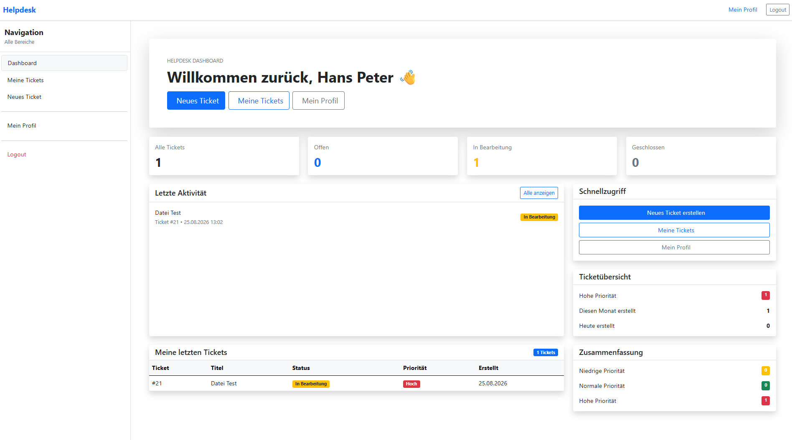
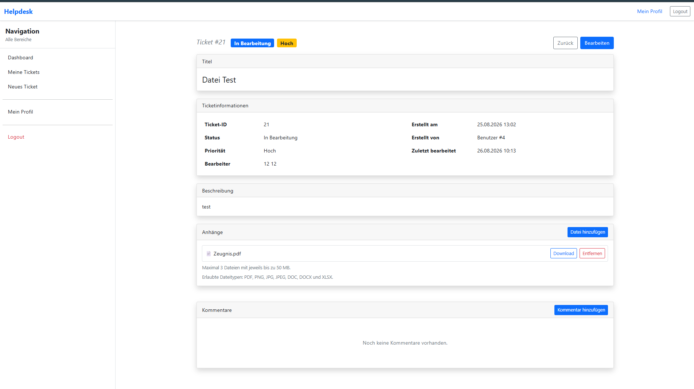
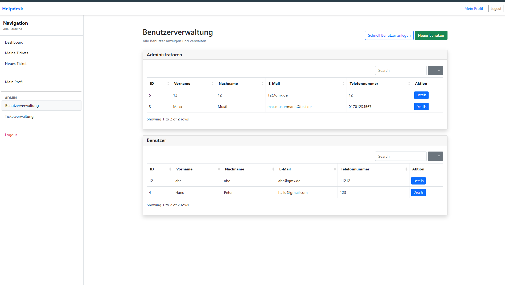

# Helpdesk – Ticket and Task Management System

An internal helpdesk application for creating, managing and tracking support tickets, developed as a four-week summer project.

## Live Demo

🌐 [Open Helpdesk Web Application](https://helpdesk-web-ere2edcnh8grd6ab.germanywestcentral-01.azurewebsites.net)

🔧 [Open API Documentation (Swagger)](https://helpdesk-api-cebjdkgehwhxgxfk.germanywestcentral-01.azurewebsites.net/Swagger)

> The application is hosted on Microsoft Azure. The interface itself is currently available in German.

---

## Screenshots

### User Dashboard

### Ticket Details

### User Management

---

## Project Overview

**Project:** Development of an Internal Ticket and Task Management System

**Project Type:** Summer Project

**Project Duration:** Approx. 1 month (4 weeks)

**Apprenticeship:** Software Developer

**Technologies:**

* ASP.NET Razor Pages
* ASP.NET Web API
* Azure SQL Database
* Azure App Service
* C#
* Bootstrap
* JavaScript
* SQL Server (Stored Procedures)

---

## Project Goal

As part of a four-week summer project, an internal web application was developed to manage support tickets within a company.

Users can create, edit and comment on tickets. Administrators can manage users, process tickets, assign responsible users and track the ticket history.

---

## Project Structure

The application consists of three projects:

* **ASP.NET Razor Pages** – Frontend
* **ASP.NET Web API** – Backend
* **Class Library** – API Client

Communication between the frontend and the database is handled exclusively through the Web API.

---

## Features

### User Features

* Login and logout
* Edit profile
* Change password
* Change email address and phone number
* View own tickets
* Create new tickets
* Edit own tickets
* Write comments
* Upload files
* Download files
* Remove own files
* Dashboard with ticket overview

### Administrator Features

* User management
* Create users
* Delete users
* View user details
* View all tickets
* Change ticket status
* Change ticket priority
* Assign responsible users
* View ticket history (TicketLogs)
* Manage comments
* Download files

---

## Ticket Management

* Create and edit tickets
* View ticket details
* Comment system
* Ticket history (TicketLogs)
* File upload and download
* Comment pagination
* Character limits with live counter
* Editing disabled for closed tickets

---

## Dashboard

The dashboard provides an overview of important ticket information, including:

* Total number of tickets
* Open tickets
* Tickets in progress
* Closed tickets
* High-priority tickets
* Recent activities
* Recently created tickets
* Quick access links
* Tickets created today
* Tickets created this month

---

## Database

The database consists of the following tables:

* Benutzer
* Logins
* Tickets
* Kommentare
* TicketLogs
* Priority
* Status
* TicketDateien

Database access is handled exclusively through Stored Procedures.

---

## Security

The following security measures have been implemented:

* Password hashing
* Cookie-based authentication
* Access protection for tickets belonging to other users
* Unique email addresses
* Unique phone numbers
* Input validation
* Error handling using Try-Catch
* Closed tickets can no longer be edited

---

## File Upload

Users can upload files directly when creating a ticket.

* Maximum of 3 files per ticket
* Maximum file size of 50 MB per file
* Support for different file types
* Files can be downloaded
* Only the ticket creator can remove uploaded files

---

## Installation

A complete installation guide is available in:

[`Installation.md`](Installation.md)

It covers the following steps:

* Creating an Azure SQL Server
* Creating an Azure SQL Database
* Configuring firewall settings
* Deploying the Web API
* Deploying the Razor Pages application

---

## Project Documentation

The complete development documentation is available in:

[`Projektdokumentation.md`](Projektdokumentation.md)

---

## Author

**Name:** Daniel

**Project:** Summer Project – Ticket and Task Management System
